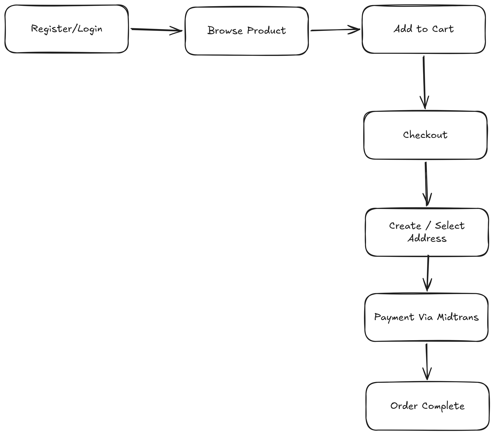
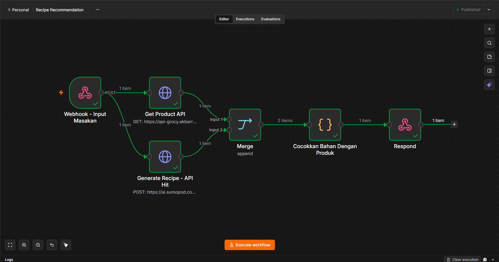

# Grocy

Grocery e-commerce platform. Monorepo (like) with three apps:

| App                | Stack                                      | Description            |
| ------------------ | ------------------------------------------ | ---------------------- |
| `backend`          | Laravel 13, PHP 8.3, Sanctum, MySQL        | REST API + admin logic |
| `frontend-admin`   | React 19, TypeScript, Vite, Tailwind CSS 4 | Admin panel            |
| `frontend-web-app` | React 19, TypeScript, Vite, Tailwind CSS 4 | Customer web app       |

## Demo

### Admin Panel

URL: https://admin-grocy.akbarrahmatm.my.id/

**Account**

- Email: `admin@grocy.test`
- Password: `admin123`

### Customer Web App

URL: https://grocy.akbarrahmatm.my.id/

**Account**

- Email: `customer@test.com`
- Password: `password`

## MVP Features

### Auth & Users

- Register / login / logout / current user (`/api/auth/*`), Sanctum token auth
- `is_customer` flag distinguishes customer vs admin/staff roles
- Admin-only middleware (`admin`) protecting management endpoints
- User management (list users, admin creates staff accounts)

### Product Management

- Category CRUD (hierarchy) — public read, admin write
- Unit of Measure (UoM) CRUD — public read, admin write
- Product CRUD with thumbnail — public browse, admin manage

### Inventory

- Stock tracking on products
- Stock adjustments (admin only)
- Stock movement history / audit log

### Integrations (Settings)

- Payment gateway configuration: **Midtrans**
- Update credentials + connection test endpoint (`/api/settings/gateways/{provider}/test`)

### E-commerce Transactions (Customer Web App)

- Address book CRUD per user
- Shopping cart API
- Shipping destination lookup + shipping rates
- Checkout → order creation

### AI Recipe Recommendation (n8n)

- Auth-gated `POST /api/recipe/suggest` (alias `/api/recipe/search`) proxies to n8n webhook
- Header `X-API-KEY: PRODUCT_WEBHOOK_SECRET` from `backend/.env` → `config/services.php:webhook.secret`
- Workflow generates ingredients + cooking steps via AI (Sumopod), matches against `GET /api/webhook/products`, returns `available_items` / `unavailable_items` / `additional_items` / `recipe[]` and enriched `products[]` (full Product with category/uom/price/thumbnail)
- Saved to `recipe_histories` per user; history endpoints `GET /api/recipe/history`, `GET /api/recipe/history/{id}`, `DELETE /api/recipe/history/{id}`
- Frontend `/recipes` requires login (`RequireAuth`), shows result grid + steps + `Not in store` chips, with persistent history list (click to reload, delete)

### Order Management

- Order list & detail (customer sees own orders, admin manages all)
- Midtrans payment webhook (`POST /api/payment/notification/midtrans`) with webhook logging

## Flow

### E-commerce (Customer)



> Register/Login → Browse Product → Add to Cart → Checkout → Create/Select Address → Payment Via Midtrans → Order Complete

### Inventory (Admin)


> Setup categories ⇒ UoM ⇒ products → Stock in/out ⇒ Stock adjustment → Every change recorded ⇒ Stock movement log (audit trail) → Order placed & paid ⇒ stock deducted automatically

### AI Recipe Recommendation (n8n workflow)



> Image: `docs/n8n_recipe_workflow.png` (if you saved as `docs/n8n_recipe_workflow` without extension, rename to `.png`) — full workflow screenshot (6 nodes, Published).

**Trigger → Backend proxy → n8n → AI + product match → Respond → History**

```
frontend-web-app /recipes  ──POST /api/recipe/suggest {dish}──►  Laravel RecipeController@suggest
  (auth:sanctum, RequireAuth)         │  X-API-KEY: PRODUCT_WEBHOOK_SECRET
                                      ▼
                          https://workflow.akbarrahmatm.my.id/webhook/ai-recipe
                                      │
                          n8n: Webhook - Input Masakan (POST)
                                ┌─────┴─────┐
                                ▼           ▼
                    Get Product API    Generate Recipe - API Hit
               GET https://api-grocy...  POST https://ai.sumopod.co... (Sumopod LLM)
                                │           │  prompt: dish → ingredients + steps
                                └─────┬─────┘
                                      ▼
                              Merge (append) — 2 items
                                      ▼
                      Cocokkan Bahan Dengan Produk ({ } Code node)
                        fuzzy match ingredient names vs Product.name/stock
                              → available_items (id,name,stock,ingredient)
                                unavailable_items / additional_items (id:null)
                                recipe: string[] steps
                                      ▼
                                  Respond (1 item JSON)
                                      │
                                      ▼
                          Laravel enriches available_items with full Product models
                          (Product::whereIn ids → category/uom/price/thumbnail)
                          saves RecipeHistory {user_id, dish, total_items, json fields}
                                      │
                                      ▼
                              frontend renders products grid + steps
                              + history list (GET /api/recipe/history)
```

**Nodes (left → right, per screenshot):**

| #   | Node                             | Type                    | Config                                                                                                                                                                                                          |
| --- | -------------------------------- | ----------------------- | --------------------------------------------------------------------------------------------------------------------------------------------------------------------------------------------------------------- |
| 1   | **Webhook - Input Masakan**      | n8n Webhook (POST)      | Path `/webhook/ai-recipe`, header `X-API-KEY` validated by Laravel proxy, body `{ "dish": "Nasi Uduk" }`                                                                                                        |
| 2   | **Get Product API**              | HTTP Request (GET)      | `GET https://api-grocy.akbarr.../webhook/products` — header `X-Webhook-Secret: PRODUCT_WEBHOOK_SECRET` (alias `webhook.secret` middleware) — returns all active products                                        |
| 3   | **Generate Recipe - API Hit**    | HTTP Request (POST)     | `POST https://ai.sumopod.co...` — LLM generates `ingredients[]` + `recipe[]` steps for the dish; receives same `dish` from Webhook via Merge input 2                                                            |
| 4   | **Merge**                        | Merge (append)          | Mode `append`, 2 inputs → 2 items combined (products list + AI recipe)                                                                                                                                          |
| 5   | **Cocokkan Bahan Dengan Produk** | Code / Function (`{ }`) | JS matches AI ingredients to product names (case-insensitive/contains), splits `available_items` (found, with `id/stock`), `unavailable_items`, `additional_items` (`id:null` not in store), plus `total_items` |
| 6   | **Respond**                      | Respond to Webhook      | Returns JSON `{ dish, total_items, available_items[], unavailable_items[], additional_items[], recipe[] }` — example: `Nasi Uduk` → 13 available (Beras Ketan, Santan…), 7 additional (daun pandan…), 9 steps   |

**APIs exposed by Laravel:**

| Method   | Path                       | Auth           | Description                                                                              |
| -------- | -------------------------- | -------------- | ---------------------------------------------------------------------------------------- |
| `POST`   | `/api/recipe/suggest`      | `auth:sanctum` | Proxy to n8n, body `{dish}` or legacy `{query}`, returns enriched payload + `history_id` |
| `POST`   | `/api/recipe/search`       | `auth:sanctum` | Alias for backwards compat (old `recipeApi`)                                             |
| `GET`    | `/api/recipe/history`      | `auth:sanctum` | Paginated history for current user (`paginate 20`, `orderBy created_at desc`)            |
| `GET`    | `/api/recipe/history/{id}` | `auth:sanctum` | Re-hydrates `products[]` for that history entry                                          |
| `DELETE` | `/api/recipe/history/{id}` | `auth:sanctum` | Soft? hard delete — removes entry                                                        |

**Persistence:**

- Migration `2026_08_26_000000_create_recipe_histories_table.php` → `recipe_histories` (`id`, `user_id FK cascade`, `dish`, `total_items`, `available_items JSON`, `unavailable_items JSON`, `additional_items JSON`, `recipe JSON`, `timestamps`, index `user_id+created_at`)
- Model `App\Models\RecipeHistory` with casts `array` for JSON columns
- Controller saves on every successful suggest; failures are logged not blocking response (`Log::warning`)

**Frontend:** `frontend-web-app/src/pages/Recipes.tsx` — guard `if !user → /login`, `recipeApi.suggest/ history/ historyShow/ historyDelete`, history panel under AI hero with click-to-reload + delete; `frontend-web-app/src/lib/api.ts:RecipeSuggestResponse`.

## Getting Started

### Backend

```bash
cd backend
composer install
cp .env.example .env
# set PRODUCT_WEBHOOK_SECRET in .env (same key for n8n X-API-KEY and GET /webhook/products)
php artisan key:generate
php artisan migrate   # includes recipe_histories
php artisan serve   # http://127.0.0.1:8000
```

Test AI recipe (auth required):

```bash
curl --location 'http://127.0.0.1:8000/api/recipe/suggest' \
  --header 'Authorization: Bearer <SANCTUM_TOKEN>' \
  --header 'Content-Type: application/json' \
  --data '{"dish":"Nasi Uduk"}'

# direct n8n (via proxy secret, not Sanctum)
curl --location 'https://workflow.akbarrahmatm.my.id/webhook/ai-recipe' \
  --header 'Content-Type: application/json' \
  --header 'X-API-KEY: $PRODUCT_WEBHOOK_SECRET' \
  --data '{"dish":"Nasi Uduk"}'
```

API docs generated by [Scramble](https://scramble.dedoc.co/) at `/docs/api`.

### Frontend Admin

```bash
cd frontend-admin
npm install
npm run dev         # http://localhost:5173
```

### Frontend Web App

```bash
cd frontend-web-app
npm install
npm run dev
```

Both frontends read the API base URL from `VITE_API_URL` (default `http://127.0.0.1:8000`). Set `FRONTEND_URL` in backend `.env` for CORS.
